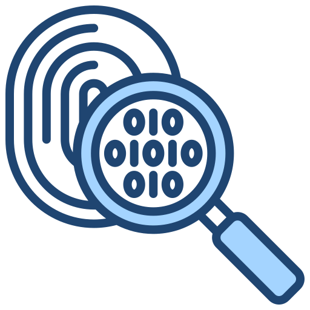

# CTF Swiss Army Knife

An all-in-one Capture The Flag Challenges solving tool written in <b>Python</b> that combines various utilities commonly needed in CTF challenges. This tool provides a modern, user-friendly GUI interface for various CTF-related tasks on a windows environment.

<br/>

#  Features

<br/>

###   Cryptography
Decrypt various commonly used and advanced cypher techniques such as <b>Caesar cipher, Vigenère cipher (along with a brute force option to get key), ROT13, Atbash, AES encryption/decryption (ECB and CBC modes), DES encryption/decryption, Triple DES support, XOR operations.</b>

Also supports various Encoding/Decoding operations such as <b>Base16/32/58/64/85/91 conversions, Hex encoding/decoding, Binary encoding/decoding, Decimal encoding/decoding & ASCII Manipulation Format (AMF).</b>

Includes a Smart Detection technique for Automatic format detection and Deep analysis for encoded content. Supports Flag pattern recognition & Multiple encoding layer detection

<br/>


###  Steganography
Supports Image Steganography techniques such as LSB (Least Significant Bit) analysis, Data extraction from images and Image format analysis.

Supports Image Audio techniques such as Spectrogram analysis and generation using matplotlib, Image to audio spectrogram conversion, Audio file analysis and Data extraction from audio


###  Forensics
Supports File Analysis features such as Metadata extraction, File format detection, Magic number analysis, Compression/Zip detection.

Supports External Tools if you have them installed on your device. Tools such as Steghide, Binwalk, Stegsolve, Zsteg, ExifTool, are required to be installed externally to the SYSTEM PATH for the program to detect and use them.

###  Format Conversion
Includes a Universal Converter for Text format conversion, Multiple input/output format support, Real-time format analysis, Smart format detection

Supported Formats: <b>Text, Hexadecimal, Decimal, Binary, Octal, Base64, Base32, Base16, Base85 </b>


###  Hex Dump Analysis
Supports hex dumb analysis, editing and saving edited files for supported files formats. 
Also has support to automatically suggest fix for common headers using hex dump of corrupt files for various formats.

###  Auto Tab
Includes a one click solution auto tab to automatically find a general or user specified text/string format within the input text/file automatically using various techniques at once and return the string if found. The auto tab may not be able to find flags/strings requiring multiple steps or advanced tools.

### Screenshots
 
 
 
 
 


## Installation

Direct Installation:
1. Download the latest release from the releases page
2. Extract the archive
3. Run the CTFSwissArmyKnife.exe

Python CLI:
> [!TIP]
> Install in a virtual environment for easy access.
> To make a virtual environment, use
> ```
> python -m venv venv
> ```
> and activate using
>```
> venv\Scripts\activate
>```

1. Ensure python and pip are installed on your device.
2. Run
   ```
   pip install git+https://github.com/Unknnownnn/CTF-swiss-army-knife.git
   ```
3. After installing, run
   ```
   ctf-sak
   ```
4. To uninstall the application, run
   ```
   pip uninstall ctf-swiss-army-knife
   ```


## Dependencies

All required dependencies are bundled with the executable. No additional installation is needed.

## License

This project is licensed under the MIT License - see the LICENSE file for details. 
